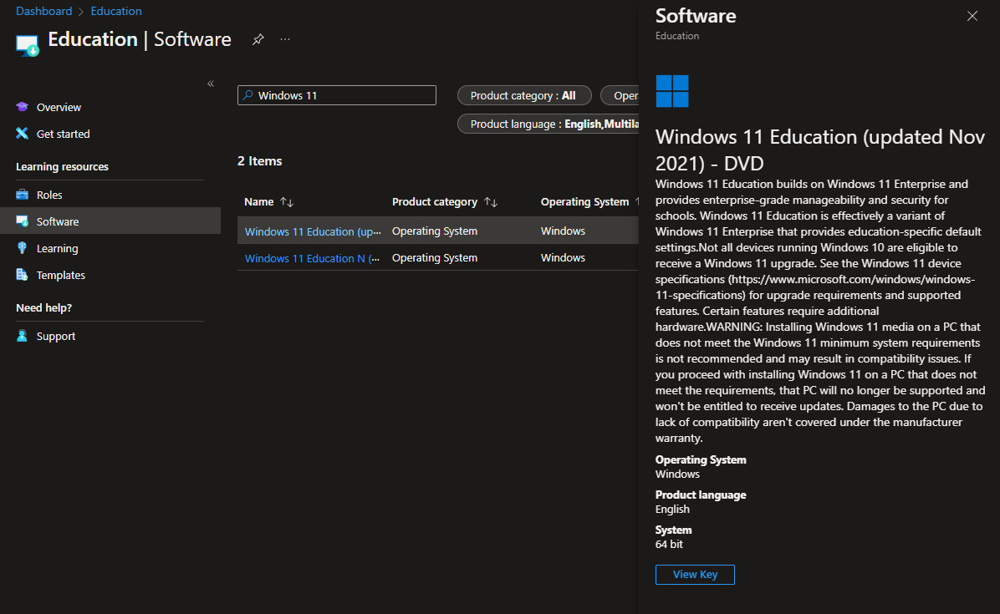
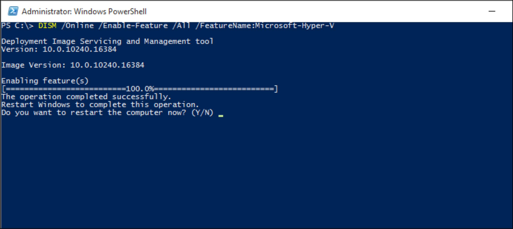


# How to update Windows 11 license from home to education and activate Hyper-V

#### 1) Backup Windows license
* Start Powershell or CMD 
* Run a command
```
wmic path SoftwareLicensingService get OA3xOriginalProductKey
```
* Save it in a safe place 😊

#### 2) Getting a new Windows 11 Education license
Log in to [Azure For Education](https://azureforeducation.microsoft.com/devtools) <br>
Find Windows 11



* View Key and save it to your computer
* Click start menu and type Windows activation


* Choose Change product key and input your License key for Windows 11. <br>
Windows license update will end in strange error THAT IS A NORMAL MICROSOFT WAY TO SAY **“JOB WELL DONE”**. 
Restart your computer and Windows will activate new license in 1-3 minutes. 

#### 3) TMP / Enabling Virtualization in BIOS/UEFI
- [How to enable virtualization? ](https://www.isumsoft.com/computer/enable-virtualization-technology-vt-x-in-bios-or-uefi.html)
- [How to access BIOS settings for different manufacturer? ](https://2nwiki.2n.cz/pages/viewpage.action?pageId=75202968)


#### 4) Activate Hyper-V

* Start Powershell with Adminitrator rights (Run as Administrator)

```
Enable-WindowsOptionalFeature -Online -FeatureName Microsoft-Hyper-V -All
```




*Restart your computer finalize the changes to your operating system*


***Congratulations, you have updated your Windows 11 licence and activated Hyper-v***
